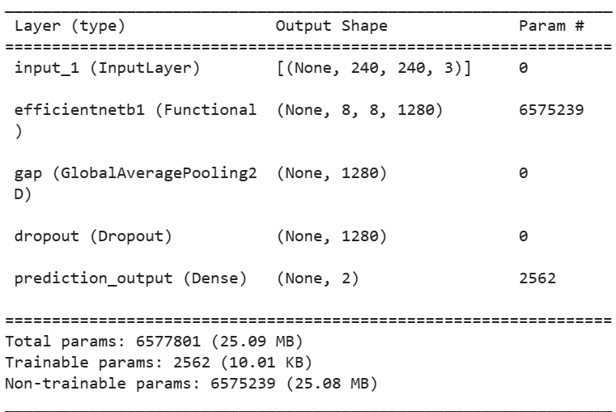

# Melanoma Cancer Classification

## Overview

Melanoma, a potentially life-threatening form of skin cancer, requires early detection for effective treatment. This project employs state-of-the-art deep learning techniques, specifically leveraging the EfficientNetB1 backbone and advanced augmentation strategies, to develop a highly accurate and robust model for automated melanoma skin lesion classification.

- **EfficientNetB1 Backbone:** The project harnesses the power of EfficientNetB1, a well-balanced convolutional neural network architecture, striking an optimal balance between model complexity and performance.

- **Augmentation Strategies:** Data augmentation techniques are implemented to enhance the model's ability to generalize across diverse skin lesion images, ensuring reliable performance in real-world scenarios.

- **Early Detection:** The primary goal is to enable early detection of melanoma lesions through the automated analysis of skin images, contributing to improved patient outcomes and reduced mortality rates.

## Environment Setup

- Clone this repository:

```bash
git clone https://github.com/Hamana0509/Melanoma-cancer-classification.git
cd Melanoma-cancer-classification
```

## Model Architecture

The Melanoma classification model is built on the EfficientNetB1 architecture, a state-of-the-art convolutional neural network designed for efficient and effective image classification. EfficientNetB1 strikes a balance between model size and performance, making it well-suited for tasks where computational resources may be limited. The model architecture is implemented using TensorFlow



## Summary

### Model Result

- Test Loss: 0.22894
- Test Accuracy: 91.70%

### Review and Evaluation

- The model is performing well, as evidenced by a relatively low test loss.
- The accuracy of 91.70% suggests that the model is correctly classifying the majority of the test samples.
